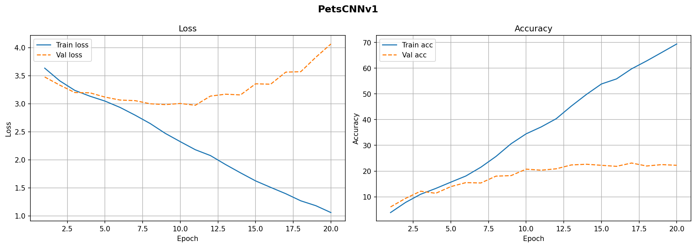
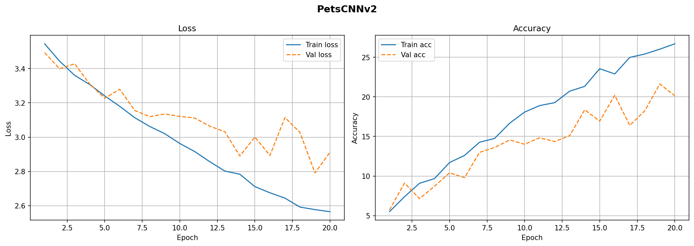
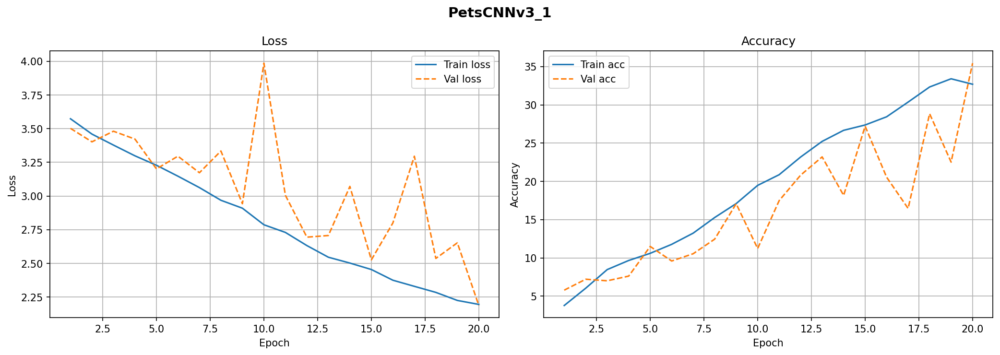
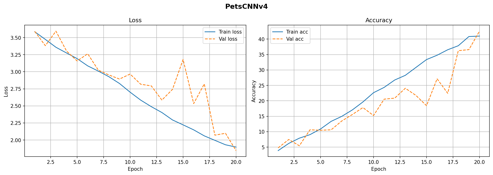
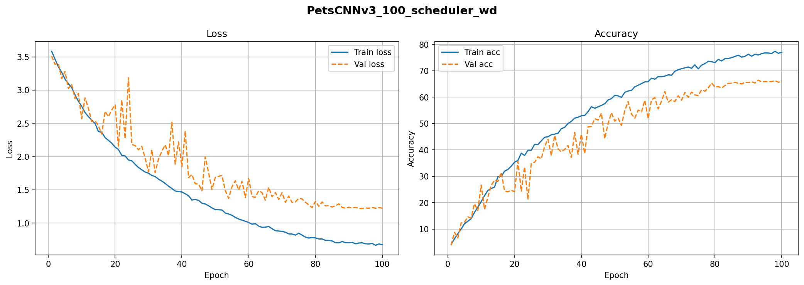
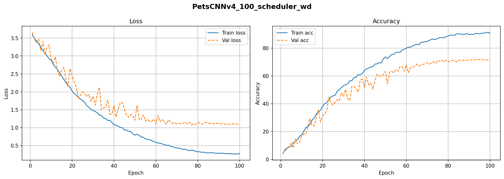

# Raport – Klasyfikacja ras zwierząt (Oxford-IIIT Pets)

---

## Pierwszy model – PetsCNNv1
> 3 warstwy konwolucyjne, brak dropout / batchnorm

**Hiperparametry:** EPOCH = 20 | LR = 0.001 | BATCH SIZE = 64

```
PetsCNNv1(
  (features): Sequential(
    (0): Conv2d(3, 32, kernel_size=(3, 3), stride=(1, 1), padding=(1, 1))
    (1): ReLU()
    (2): MaxPool2d(kernel_size=2, stride=2)
    (3): Conv2d(32, 64, kernel_size=(3, 3), stride=(1, 1), padding=(1, 1))
    (4): ReLU()
    (5): MaxPool2d(kernel_size=2, stride=2)
    (6): Conv2d(64, 128, kernel_size=(3, 3), stride=(1, 1), padding=(1, 1))
    (7): ReLU()
    (8): MaxPool2d(kernel_size=2, stride=2)
  )
  (classifier): Sequential(
    (0): Flatten(start_dim=1, end_dim=-1)
    (1): Linear(in_features=100352, out_features=512, bias=True)
    (2): ReLU()
    (3): Linear(in_features=512, out_features=37, bias=True)
  )
)
```


**Wynik końcowy:** Train acc: **69.43%** | Test acc: **22.24%**



---

## Drugi model – PetsCNNv2
> BatchNorm + Dropout, AdaptiveAvgPool

**Hiperparametry:** EPOCH = 20 | LR = 0.001 | BATCH SIZE = 64

```
PetsCNNv2(
  (features): Sequential(
    (0): Conv2d(3, 64, ...) → BatchNorm2d → ReLU → MaxPool2d
    (4): Conv2d(64, 128, ...) → BatchNorm2d → ReLU → MaxPool2d
    (8): Conv2d(128, 256, ...) → BatchNorm2d → ReLU → MaxPool2d
  )
  (classifier): Sequential(
    (0): AdaptiveAvgPool2d(output_size=(1, 1))
    (1): Flatten → Linear(256→512) → ReLU → Dropout(0.2) → Linear(512→37)
  )
)
```


**Wynik końcowy:** Train acc: **26.71%** | Test acc: **20.14%**



---

## Trzeci model – PetsCNNv3
> 5 warstw konwolucyjnych, BatchNorm + Dropout, głębszy klasyfikator

**Hiperparametry:** EPOCH = 20 | LR = 0.001 | BATCH SIZE = 64

```
PetsCNNv3(
  (features): Conv(3→32) → Conv(32→64) → Conv(64→128) → Conv(128→256) → Conv(256→512)
              z BatchNorm i MaxPool po każdym bloku
  (classifier): AdaptiveAvgPool → Linear(512→256) → Dropout(0.2) → Linear(256→128) → Dropout(0.2) → Linear(128→37)
)
```


**Wynik końcowy:** Train acc: **32.83%** | Test acc: **26.12%**



---

## Czwarty model – PetsCNNv4
> Głębsza architektura (podwójne bloki Conv na każdym poziomie), BatchNorm + Dropout

**Hiperparametry:** EPOCH = 20 | LR = 0.001 | BATCH SIZE = 64

```
PetsCNNv4(
  (features): Conv(3→32) → Conv(32→64) → Conv(64→128)
              → Conv(128→256) + Conv(256→256)   ← podwójny blok
              → Conv(256→512) + Conv(512→512)   ← podwójny blok
              z BatchNorm i MaxPool
  (classifier): AdaptiveAvgPool → Linear(512→256) → Dropout(0.2) → Linear(256→128) → Dropout(0.2) → Linear(128→37)
)
```


**Wynik końcowy:** Train acc: **40.99%** | Test acc: **42.59%**



---

## Trzeci model – 100 epok + LR Scheduler + Weight Decay

**Hiperparametry:** EPOCH = 100 | LR = 0.001 + scheduler | BATCH SIZE = 64 | Weight Decay

```
PetsCNNv3 (ta sama architektura co wyżej)
```


**Wynik końcowy:** Train acc: **77.02%** | Test acc: **66.19%**



---

## Czwarty model – 100 epok + LR Scheduler + Weight Decay

**Hiperparametry:** EPOCH = 100 | LR = 0.001 + scheduler | BATCH SIZE = 64 | Weight Decay | Dropout = 0.3

```
PetsCNNv4 (ta sama architektura co wyżej, Dropout zwiększony do 0.3)
```


**Wynik końcowy:** Train acc: **90.64%** | Test acc: **71.84%**



---

## Podsumowanie wyników

| Model | Epoki | Train Acc | Test Acc | Uwagi |
|-------|------:|----------:|---------:|-------|
| PetsCNNv1 | 20 | 69.43% | 22.24% | Brak BatchNorm/Dropout – silny overfitting |
| PetsCNNv2 | 20 | 26.71% | 20.14% | BatchNorm + Dropout, ale słaba zbieżność w 20 epokach |
| PetsCNNv3 | 20 | 32.83% | 26.12% | Głębsza sieć, potrzebuje więcej epok |
| PetsCNNv4 | 20 | 40.99% | **42.59%** | Najlepszy wynik w 20 epokach |
| PetsCNNv3 | 100 + sched + wd | 77.02% | 66.19% | Duży skok po zwiększeniu epok |
| **PetsCNNv4** | **100 + sched + wd** | **90.64%** | **71.84%** | **Najlepszy wynik ogólnie** |

---

## Wnioski

**Największy wpływ miały LR Scheduler i Weight Decay** – bez nich v4 osiągnął 42% test acc, z nimi 72%. Samo wydłużenie treningu do 100 epok bez tych technik niewiele by dało.

**BatchNorm i Dropout są niezbędne** – v1 bez nich mocno się przeuczył (69% train, tylko 22% test). Każdy kolejny model z tymi technikami miał mniejszą lukę między train a test acc.

**Głębsza sieć = lepsze wyniki**, ale potrzebuje więcej czasu. V4 z podwójnymi blokami konwolucyjnymi wypadł najlepiej, jednak przy 20 epokach jego przewaga nad prostszymi modelami była niewielka.

**Overfitting nadal jest problemem** – najlepszy model kończy z 90% train acc i 72% test acc. Żeby to poprawić, warto dodać augmentację danych (flip, crop, color jitter) i rozważyć wyższy dropout.

**Co dalej:** największy skok jakości da prawdopodobnie transfer learning (np. ResNet-50 pretrenowany na ImageNet), który na tym datasecie realnie celuje w 85–90%+ bez dużego nakładu pracy.
